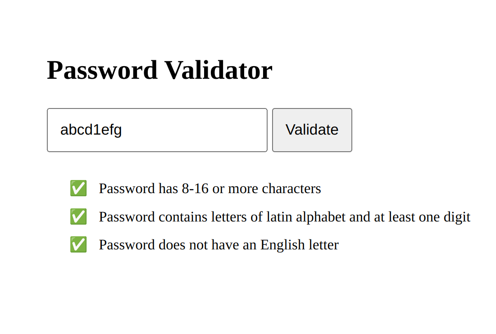
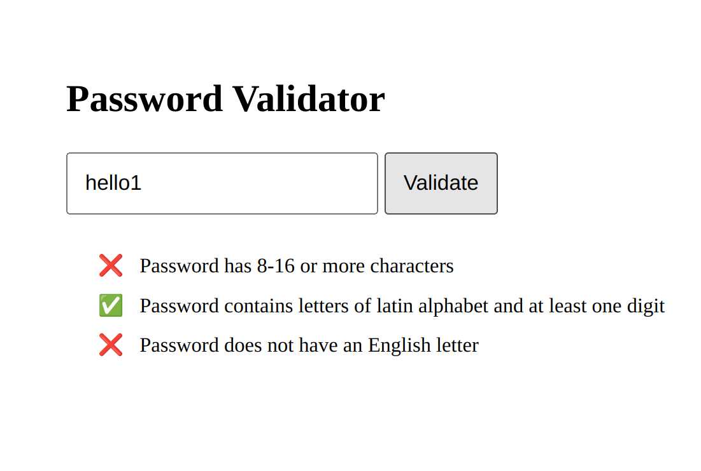

# Password-Validator
Validate a password based on the following rules:
- It should have the length of 8-16 symbols
- It should contain letters of latin alphabet and at least one digit
- It should not contain full english words (you can use any free dictionary API to check this)

### How to use
Download and open `validator.html` in any browser. You can also visit https://jsfiddle.net/h2j71z5g/66/ to try it instantly. 

### Images

